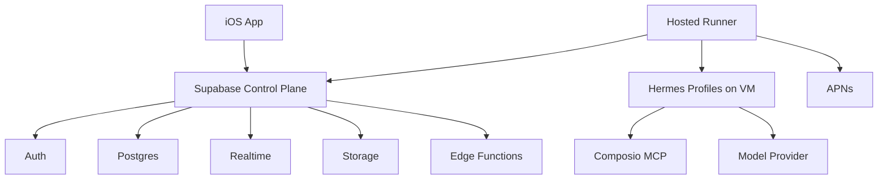
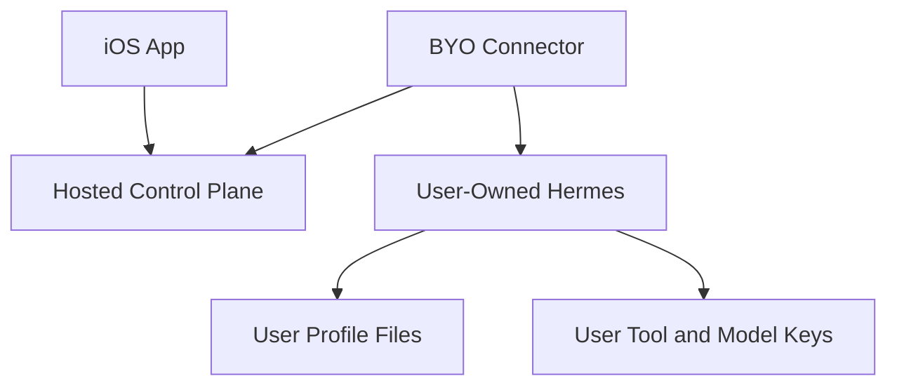
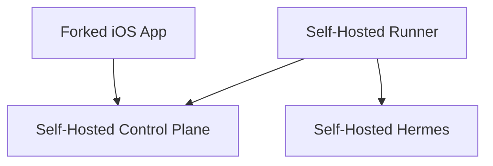

# Architecture

Doit is an iOS GUI and control plane for Hermes agents.

The important split is between the **control plane** and the **execution unit**.

- **Control plane**: authentication, task state, realtime updates, attachments,
  Edge Functions, admin APIs, and mobile app synchronization.
- **Execution unit**: runner or connector, Hermes gateway, Hermes profile files,
  memory files, and tool/model credentials.

## Current Hosted Architecture

The current production path is hosted mode:

In hosted mode, one VM runs the runner and many Hermes profiles. The runner
watches Supabase, claims work, calls the local Hermes gateway, writes task
progress back to Postgres, and sends APNs.

The iOS app does not call Hermes directly. It reads and writes Supabase rows and
listens to Supabase Realtime.

## Planned BYO Connector Architecture

The intended BYO path moves the execution unit to user-owned infrastructure:

This is the right first BYO shape because the runner currently needs local
access to Hermes profile files for memory, settings, and skills. Running the
connector beside Hermes avoids exposing Hermes directly to the public internet
or requiring the hosted runner to reach into a user's private network.

## Full Self-Host

Full self-hosting means the operator runs both sides:

This gives the operator the strongest control over data because they own the
database, runner credentials, Hermes profiles, app signing, and third-party
keys.

## Direct Hermes Endpoint

A direct endpoint mode, where a user pastes a Hermes URL into the app or hosted
control plane, is not the first recommended BYO implementation. It needs a
clear remote security model and replacement APIs for the profile filesystem
operations the runner performs today.
