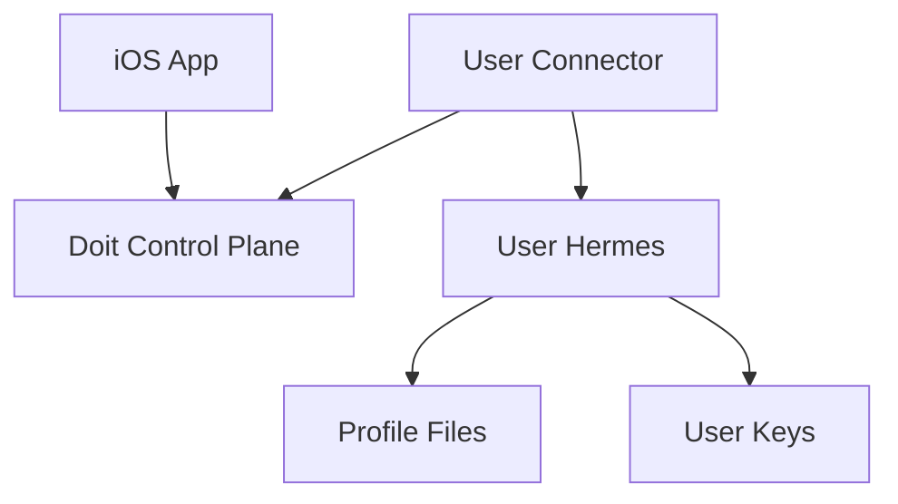

# BYO Hermes Connector

BYO Hermes connector mode is the first path for people who want Doit as an iOS
GUI over their own Hermes setup.

In the MVP, the iOS app still uses the hosted Supabase sync layer for auth,
tasks, realtime updates, attachments, APNs, and Live Activities, but Hermes
execution moves to user-owned infrastructure.

## Setup Difficulty

BYO Hermes is for users who already have Hermes running somewhere. If they do,
setup should feel like:

- **Easy** if Hermes is already running on a VPS or home server and the user can
  SSH into it.
- **Moderate** if Hermes is on a Tailscale/private-network machine and the user
  needs to confirm the right hostname and port.
- **Developer-oriented** if Hermes is only running locally on a laptop, because
  the connector must stay online whenever they want Doit tasks to run.

The app does not need to understand VPS, Tailscale, or local networking. The
only requirement is: run the connector on a machine that can reach Hermes and
can make outbound HTTPS requests to the Doit sync layer.

## Intended Use Cases

- Hermes running on a user-owned VPS.
- Hermes running on a home server.
- Hermes reachable on a Tailscale or other private network node.
- Eventually, Hermes running on a local workstation for development.

## Why A Connector?

The current runner does more than call the Hermes HTTP API. It also works with
local Hermes profile files for memory, settings, and skills. Because of that,
the first BYO design should run a connector beside Hermes instead of making the
hosted runner call directly into user infrastructure.



## Current MVP Flow

1. In the app, choose **Connect my Hermes** before Apple sign-in.
2. Continue without Apple. The app creates an anonymous hosted-sync identity.
3. The app shows a pairing code and connector command.
4. Run the connector beside Hermes on your VPS, Tailscale node, home server, or
   local development machine.
5. The connector heartbeats capabilities, claims only that paired user's tasks,
   calls local Hermes, and writes task progress back to the hosted sync layer.

The app communicates this boundary explicitly: Doit uses your Hermes setup
as-is. Model keys, OAuth connections, memory files, tools, Browserbase,
Composio, and TTS config remain owned by your Hermes setup.

## What Users Need Before Starting

- A working Hermes gateway.
- The Hermes URL from the connector machine, usually
  `http://127.0.0.1:<port>` when the connector runs on the same host.
- The Hermes API key if that gateway requires one.
- Python and the Doit runner package available on the machine running the
  connector.
- Outbound internet access from the connector machine to the hosted Doit
  Supabase project.

They do **not** need Apple login for BYO connector mode. They also do not need
to move model keys, Composio connections, Browserbase config, TTS config, tools,
or memory files into Doit.

## Where To Run The Connector

### Same VPS As Hermes

This is the simplest path. SSH into the VPS and run the connector there:

```bash
python -m runner.connector \
  --supabase-url "https://YOUR_PROJECT.supabase.co" \
  --supabase-anon-key "YOUR_SUPABASE_ANON_KEY" \
  --connector-token "doit_conn_..." \
  --hermes-url "http://127.0.0.1:8643" \
  --hermes-api-key "YOUR_LOCAL_HERMES_API_KEY"
```

Use `127.0.0.1` because the connector and Hermes are on the same machine.

### Tailscale Or Private Network

Run the connector on any machine that can reach the Hermes host over the private
network:

```bash
python -m runner.connector \
  --supabase-url "https://YOUR_PROJECT.supabase.co" \
  --supabase-anon-key "YOUR_SUPABASE_ANON_KEY" \
  --connector-token "doit_conn_..." \
  --hermes-url "http://my-hermes-tailnet-name:8643" \
  --hermes-api-key "YOUR_LOCAL_HERMES_API_KEY"
```

The iOS app still does not connect to Tailscale. Only the connector needs
private-network access to Hermes.

### Local Development Machine

This works for testing, but the connector must stay running:

```bash
python -m runner.connector \
  --supabase-url "https://YOUR_PROJECT.supabase.co" \
  --supabase-anon-key "YOUR_SUPABASE_ANON_KEY" \
  --connector-token "doit_conn_..." \
  --hermes-url "http://127.0.0.1:8643" \
  --hermes-api-key "YOUR_LOCAL_HERMES_API_KEY"
```

If the laptop sleeps, disconnects, or the terminal process stops, Doit can still
show tasks but Hermes will not execute new work until the connector comes back.

## Connector Responsibilities

The connector should:

- authenticate with a scoped connector token
- claim only the owning user's work
- call local or private-network Hermes
- leave local Hermes profile files as the source of truth
- write task status, activity, artifacts, and terminal results back to the
  control plane
- report health and capabilities

## Running The Developer Preview Connector

The connector entrypoint is:

```bash
python -m runner.connector \
  --supabase-url "https://YOUR_PROJECT.supabase.co" \
  --supabase-anon-key "YOUR_SUPABASE_ANON_KEY" \
  --connector-token "doit_conn_..." \
  --hermes-url "http://127.0.0.1:8643" \
  --hermes-api-key "YOUR_LOCAL_HERMES_API_KEY"
```

The connector uses the public Supabase anon key plus a scoped connector token.
Task claims and writes go through the connector Edge Function, so BYO users do
not receive service-role material.

## What The App Shows

During pairing, the app should show:

- the generated connector command
- `Waiting for connector...`
- a capability summary once the connector heartbeats
- clear copy that Doit is using Hermes as-is

After pairing, the app should behave like the normal task UI. The user creates a
task, the connector claims it, Hermes executes it, and the app streams status
and activity from the hosted sync layer.

## App Behavior In BYO Mode

- Model settings show that models are managed by Hermes.
- Integrations show that OAuth/tool connections are managed by Hermes.
- Memory and Passbook show local-memory guidance and do not edit or sync
  `USER.md`, `SOUL.md`, `MEMORY.md`, or other Hermes memory files.
- New app tasks skip hosted prep and go straight to connector-claimable work.
- APNs and Live Activities continue to work for hosted-sync BYO because Doit
  still owns the mobile sync layer.

## Direct Endpoint Mode

Direct endpoint mode, where a user provides a remote Hermes URL/API key, is a
later option. It needs separate security work and either Hermes APIs for memory
and settings or reduced feature support.

Pure-local mode, where the app talks directly to a local connector and bypasses
hosted Supabase entirely, is also future work. That mode would need a different
mobile sync story and self-managed push/Live Activity behavior.

## Troubleshooting

### The App Stays On “Waiting For Connector”

Check that:

- the connector process is still running
- the connector token matches the command shown in the app
- the connector machine can reach the Supabase URL over HTTPS
- the required backend migration and Edge Functions are deployed

### The Connector Starts But Tasks Do Not Run

Check that:

- Hermes is reachable from the connector machine
- `--hermes-url` points to the right host and port
- the Hermes API key is correct, if the gateway requires one
- the task belongs to the paired BYO user

### Hermes Runs But Integrations Do Not Work

Doit does not create hosted Composio sessions in BYO mode. The user’s Hermes
profile must already have the needed tools and OAuth connections configured.

### Model Or Memory Looks Different Than Hosted Doit

That is expected. BYO mode treats Hermes as the source of truth. Model config,
memory files, custom instructions, tools, and TTS are managed by the user’s
Hermes setup, not by Doit.

## Privacy

BYO connector mode moves Hermes execution and profile files to user-owned
infrastructure. If the connector still uses the hosted Doit control plane,
task state stored in that control plane may still be visible to the hosted
operator. Full self-hosting is the strongest privacy path.
