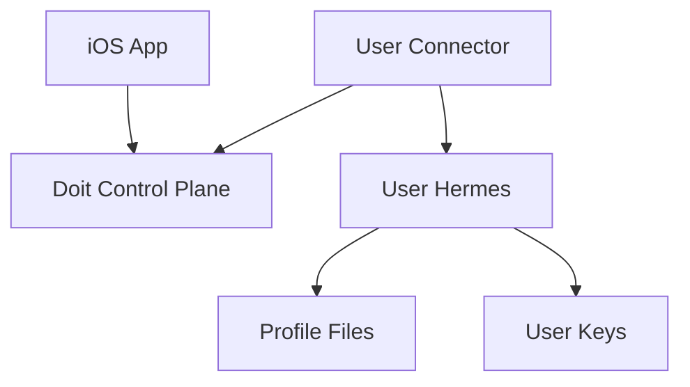

# BYO Hermes Connector

BYO Hermes connector mode is the first path for people who want Doit as an iOS
GUI over their own Hermes setup.

In the MVP, the iOS app still uses the hosted Supabase sync layer for auth,
tasks, realtime updates, attachments, APNs, and Live Activities, but Hermes
execution moves to user-owned infrastructure.

## Setup Difficulty

BYO Hermes is for users who already have Hermes running somewhere. If they do,
setup should feel like:

- **Easy** if Hermes is already running on a VPS or home server and the user can
  SSH into it.
- **Moderate** if Hermes is on a Tailscale/private-network machine and the user
  needs to confirm the right hostname and port.
- **Developer-oriented** if Hermes is only running locally on a laptop, because
  the connector must stay online whenever they want Doit tasks to run.

The app does not need to understand VPS, Tailscale, or local networking. The
only requirement is: run the connector on a machine that can reach Hermes and
can make outbound HTTPS requests to the Doit sync layer.

## Intended Use Cases

- Hermes running on a user-owned VPS.
- Hermes running on a home server.
- Hermes reachable on a Tailscale or other private network node.
- Eventually, Hermes running on a local workstation for development.

## Why A Connector?

The current runner does more than call the Hermes HTTP API. It also works with
local Hermes profile files for memory, settings, and skills. Because of that,
the first BYO design should run a connector beside Hermes instead of making the
hosted runner call directly into user infrastructure.



## Current MVP Flow

1. In the app, choose **Connect my Hermes** before Apple sign-in.
2. Continue without Apple. The app creates an anonymous hosted-sync identity.
3. The app shows a pairing code and connector command.
4. Run the connector beside Hermes on your VPS, Tailscale node, home server, or
   local development machine.
5. The connector heartbeats capabilities, claims only that paired user's tasks,
   calls local Hermes, and writes task progress back to the hosted sync layer.

The app communicates this boundary explicitly: Doit uses your Hermes setup
as-is. Model keys, OAuth connections, memory files, tools, browser automation,
and voice config remain owned by your Hermes setup.

## Pairing In The App

This is the user-facing flow in the iOS app today:

1. On the launch screen, tap **Connect my Hermes**.
2. The app signs you in anonymously (no Apple account required) and opens the
   **Pair your Hermes connector** screen.
3. Copy the generated connector command from the app.
4. Run it on a machine that can reach your Hermes HTTP API — usually the same
   VPS or server where Hermes already runs.
5. Keep the connector process running while you use Doit.
6. When the app shows **Connector found**, pairing is complete and the normal
   task UI opens.

If you get stuck before the connector is running, use **Copy Hermes prompt** in
the app and paste it into your existing Hermes chat. Hermes can help you find
the right host, port, API key, and terminal command for your setup.

## Hermes Setup And Documentation

BYO connector mode assumes you already have a working Hermes gateway. Doit does
not install or configure Hermes for you in this path.

Start here if Hermes is not running yet, or if you need to verify the gateway,
API key, tools, or memory setup:

| Resource | Link |
| --- | --- |
| Hermes docs home | [hermes-agent.nousresearch.com/docs](https://hermes-agent.nousresearch.com/docs/) |
| Quickstart | [Getting started / quickstart](https://hermes-agent.nousresearch.com/docs/getting-started/quickstart) |
| FAQ and troubleshooting | [FAQ & troubleshooting](https://hermes-agent.nousresearch.com/docs/getting-started/faq) |
| Source repo | [github.com/NousResearch/hermes-agent](https://github.com/NousResearch/hermes-agent) |

For operator-style deployment notes used by hosted Doit, see
[`../hermes/setup.md`](../hermes/setup.md). That runbook is optional for BYO
users who already manage their own Hermes install.

## Ask Hermes For Help

If you are less comfortable with SSH, ports, or systemd, paste a prompt like
this into Hermes after copying the connector command from the app:

```text
I want to connect my existing Hermes setup to the Doit iOS app using BYO connector mode.

Please help me figure out where to run this connector command. It should run on a machine that can reach my Hermes HTTP API, usually the same VPS/server where Hermes is already running.

Connector command:
<paste the command from the Doit app here>

Please check:
1. Whether Hermes is running and what host/port I should use for --hermes-url.
2. Whether I need a Hermes API key for --hermes-api-key.
3. The exact command I should paste into my terminal.
4. How to keep the connector running after I close SSH.
```

Hermes is the best place to troubleshoot gateway health, API keys, profile
files, tools, and local networking on your machine. Doit troubleshooting below
covers only the connector and hosted sync layer.

## What Users Need Before Starting

- A working Hermes gateway.
- The Hermes URL from the connector machine, usually
  `http://127.0.0.1:<port>` when the connector runs on the same host.
- The Hermes API key if that gateway requires one.
- Python 3.11+.
- A local checkout of the Doit repo on the machine running the connector.
- Outbound internet access from the connector machine to the hosted Doit
  Supabase project.

They do **not** need Apple login for BYO connector mode. They also do not need
to move model keys, OAuth connections, browser config, voice config, tools, or
memory files into Doit.

## Install The Connector On A VPS

These steps assume Hermes is already running on the VPS and its gateway is
listening on `http://127.0.0.1:8643`.

### 1. Verify Hermes From The VPS

Run this on the same machine that will run the connector:

```bash
curl http://127.0.0.1:8643/health
```

If this fails, fix Hermes before pairing Doit. The connector can be online to
Supabase while still unable to reach Hermes.

### 2. Run The Installer Command From The App

Copy the installer command shown in the iOS app and run it on the VPS. It looks
like this:

```bash
DOIT_SUPABASE_URL="https://YOUR_PROJECT.supabase.co" \
DOIT_SUPABASE_ANON_KEY="YOUR_SUPABASE_ANON_KEY" \
DOIT_CONNECTOR_TOKEN="doit_conn_..." \
DOIT_HERMES_URL="http://127.0.0.1:8643" \
bash -c "$(curl -fsSL https://raw.githubusercontent.com/newmaterialco/doit/main/scripts/install-byo-connector.sh)"
```

If Hermes requires an API key, add `DOIT_HERMES_API_KEY="..."` before `bash`.

### What The Installer Does

The installer:

- clones or updates `https://github.com/newmaterialco/doit.git`
- creates a Python venv in `doit/runner/.venv`
- installs `runner/requirements.txt`
- checks `DOIT_HERMES_URL/health`
- writes connector secrets to `/etc/doit/connector.env`
- backs up any existing `/etc/systemd/system/doit-connector.service`
- writes and starts `doit-connector.service`

It does **not** install Hermes, expose Hermes publicly, self-host Supabase, or
modify Hermes memory/profile files.

### 3. Confirm The Connector Is Running

```bash
sudo systemctl status doit-connector.service --no-pager
sudo journalctl -u doit-connector.service --no-pager -n 50
```

You should see `BYO connector online` in the logs. The app should change from
`Waiting for connector...` to `Connector found`.

### Manual Fallback

Use this path if you do not want the installer to write a systemd service.

```bash
git clone https://github.com/newmaterialco/doit.git
cd doit/runner
python3 -m venv .venv
source .venv/bin/activate
pip install -r requirements.txt
python3 -m runner.connector \
  --supabase-url "https://YOUR_PROJECT.supabase.co" \
  --supabase-anon-key "YOUR_SUPABASE_ANON_KEY" \
  --connector-token "doit_conn_..." \
  --hermes-url "http://127.0.0.1:8643" \
  --hermes-api-key "YOUR_LOCAL_HERMES_API_KEY"
```

The working directory matters. The Python package lives at `runner/runner`, so
`python3 -m runner.connector` should be run from `doit/runner`.

### Manual systemd Service

If you use the installer, this service is created for you. If you are setting it
up manually, create `/etc/systemd/system/doit-connector.service`:

```ini
[Unit]
Description=Doit BYO Connector - Supabase to Hermes bridge
After=network-online.target
Wants=network-online.target

[Service]
Type=simple
User=YOUR_LINUX_USER
WorkingDirectory=/path/to/doit/runner
ExecStart=/path/to/doit/runner/.venv/bin/python -m runner.connector \
  --supabase-url "https://YOUR_PROJECT.supabase.co" \
  --supabase-anon-key "YOUR_SUPABASE_ANON_KEY" \
  --connector-token "doit_conn_..." \
  --hermes-url "http://127.0.0.1:8643" \
  --hermes-api-key "YOUR_LOCAL_HERMES_API_KEY"
Restart=on-failure
RestartSec=10

[Install]
WantedBy=multi-user.target
```

Then enable it:

```bash
sudo systemctl daemon-reload
sudo systemctl enable --now doit-connector.service
sudo journalctl -u doit-connector.service --no-pager -n 50
```

## Where To Run The Connector

### Same VPS As Hermes

This is the simplest path. SSH into the VPS, follow the install steps above,
then run the connector there:

Use `127.0.0.1` because the connector and Hermes are on the same machine.

### Tailscale Or Private Network

Run the connector on any machine that can reach the Hermes host over the private
network:

```bash
python3 -m runner.connector \
  --supabase-url "https://YOUR_PROJECT.supabase.co" \
  --supabase-anon-key "YOUR_SUPABASE_ANON_KEY" \
  --connector-token "doit_conn_..." \
  --hermes-url "http://my-hermes-tailnet-name:8643" \
  --hermes-api-key "YOUR_LOCAL_HERMES_API_KEY"
```

The iOS app still does not connect to Tailscale. Only the connector needs
private-network access to Hermes.

### Local Development Machine

This works for testing, but the connector must stay running:

```bash
python3 -m runner.connector \
  --supabase-url "https://YOUR_PROJECT.supabase.co" \
  --supabase-anon-key "YOUR_SUPABASE_ANON_KEY" \
  --connector-token "doit_conn_..." \
  --hermes-url "http://127.0.0.1:8643" \
  --hermes-api-key "YOUR_LOCAL_HERMES_API_KEY"
```

If the laptop sleeps, disconnects, or the terminal process stops, Doit can still
show tasks but Hermes will not execute new work until the connector comes back.

## Connector Responsibilities

The connector should:

- authenticate with a scoped connector token
- claim only the owning user's work
- call local or private-network Hermes
- leave local Hermes profile files as the source of truth
- write task status, activity, artifacts, and terminal results back to the
  control plane
- report health and capabilities

## Running The Developer Preview Connector

The connector entrypoint is run from `doit/runner`:

```bash
python3 -m runner.connector \
  --supabase-url "https://YOUR_PROJECT.supabase.co" \
  --supabase-anon-key "YOUR_SUPABASE_ANON_KEY" \
  --connector-token "doit_conn_..." \
  --hermes-url "http://127.0.0.1:8643" \
  --hermes-api-key "YOUR_LOCAL_HERMES_API_KEY"
```

The connector uses the public Supabase anon key plus a scoped connector token.
Task claims and writes go through the connector Edge Function, so BYO users do
not receive service-role material.

## What The App Shows

During pairing, the app should show:

- the generated connector command
- `Waiting for connector...`
- a capability summary once the connector heartbeats
- clear copy that Doit is using Hermes as-is

After pairing, the app should behave like the normal task UI. The user creates a
task, the connector claims it, Hermes executes it, and the app streams status
and activity from the hosted sync layer.

## App Behavior In BYO Mode

- Model settings show that models are managed by Hermes.
- Integrations show that OAuth/tool connections are managed by Hermes.
- Memory and Passbook show local-memory guidance and do not edit or sync
  `USER.md`, `SOUL.md`, `MEMORY.md`, or other Hermes memory files.
- New app tasks skip hosted prep and go straight to connector-claimable work.
- APNs and Live Activities continue to work for hosted-sync BYO because Doit
  still owns the mobile sync layer.

## Direct Endpoint Mode

Direct endpoint mode, where a user provides a remote Hermes URL/API key, is a
later option. It needs separate security work and either Hermes APIs for memory
and settings or reduced feature support.

Pure-local mode, where the app talks directly to a local connector and bypasses
hosted Supabase entirely, is also future work. That mode would need a different
mobile sync story and self-managed push/Live Activity behavior.

## Troubleshooting

Split the problem by layer:

- **Hermes-side issues** (gateway not running, wrong port, missing API key,
  tools/memory/profile problems): use the
  [Hermes FAQ & troubleshooting](https://hermes-agent.nousresearch.com/docs/getting-started/faq)
  docs or ask your Hermes agent directly.
- **Doit connector issues** (pairing, token, Supabase sync): use the sections
  below.

### The App Stays On “Waiting For Connector”

Check that:

- the connector process is still running
- the connector token matches the command shown in the app
- the connector machine can reach the Supabase URL over HTTPS
- the required backend migration and Edge Functions are deployed

### The App Says “No Hermes Profile Is Provisioned”

This means a BYO task was picked up by the hosted runner instead of the BYO
connector. BYO users intentionally do not have hosted Hermes profiles.

Make sure the hosted runner has the BYO claim-isolation fix deployed, then
create a new task. Existing failed tasks can be retried after deployment.

### The App Says “All Connection Attempts Failed”

This usually means the connector is online to Supabase, but the connector
process cannot reach Hermes at the configured `--hermes-url`.

Check from the same machine:

```bash
curl http://127.0.0.1:8643/health
```

If the connector runs under systemd, also check:

```bash
sudo journalctl -u doit-connector.service --no-pager -n 50
```

Common causes:

- Hermes is not running.
- Hermes is listening on a different port.
- The connector service is using a different `--hermes-url` than your manual
  shell test.
- Hermes requires an API key and the service is missing `--hermes-api-key`.

### Python Says “No Module Named runner”

Run the connector from the nested runner directory:

```bash
cd /path/to/doit/runner
source .venv/bin/activate
python3 -m runner.connector ...
```

### pip Fails With “externally-managed-environment”

Use a virtual environment instead of installing into the system Python:

```bash
cd /path/to/doit/runner
python3 -m venv .venv
source .venv/bin/activate
pip install -r requirements.txt
```

### The Connector Starts But Tasks Do Not Run

Check that:

- Hermes is reachable from the connector machine
- `--hermes-url` points to the right host and port
- the Hermes API key is correct, if the gateway requires one
- the task belongs to the paired BYO user

### Hermes Runs But Integrations Do Not Work

Doit does not create hosted OAuth/tool sessions in BYO mode. The user’s Hermes
profile must already have the needed tools and connections configured. See the
[Hermes tools documentation](https://hermes-agent.nousresearch.com/docs/user-guide/features/tools)
and [MCP integration guide](https://hermes-agent.nousresearch.com/docs/user-guide/features/mcp).

### Model Or Memory Looks Different Than Hosted Doit

That is expected. BYO mode treats Hermes as the source of truth. Model config,
memory files, custom instructions, tools, and TTS are managed by the user’s
Hermes setup, not by Doit. See the
[Hermes memory docs](https://hermes-agent.nousresearch.com/docs/user-guide/features/memory)
if memory behavior looks wrong on the Hermes side.

## Privacy

BYO connector mode moves Hermes execution and profile files to user-owned
infrastructure. If the connector still uses the hosted Doit control plane,
task state stored in that control plane may still be visible to the hosted
operator. Full self-hosting is the strongest privacy path.
