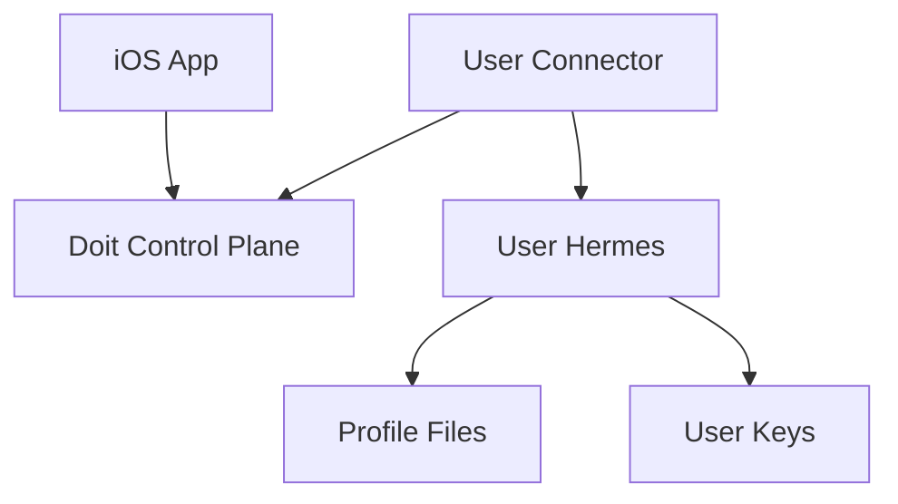

# BYO Hermes Connector

BYO Hermes connector mode is planned. It is the intended path for people who
want Doit as an iOS GUI over their own Hermes setup.

## Intended Use Cases

- Hermes running on a user-owned VPS.
- Hermes running on a home server.
- Hermes reachable on a Tailscale or other private network node.
- Eventually, Hermes running on a local workstation for development.

## Why A Connector?

The current runner does more than call the Hermes HTTP API. It also works with
local Hermes profile files for memory, settings, and skills. Because of that,
the first BYO design should run a connector beside Hermes instead of making the
hosted runner call directly into user infrastructure.

## Expected Connector Responsibilities

The connector should:

- authenticate with a scoped connector token
- claim only the owning user's work
- call local or private-network Hermes
- manage local Hermes profile files needed by the runner
- write task status, activity, artifacts, and terminal results back to the
  control plane
- report health and capabilities

## What Exists Today

Today, the production runner is built for hosted mode:

- one runner watches the Supabase project
- it claims work across users
- it provisions Hermes profiles on the hosted VM
- it calls Hermes on localhost
- it uses service-role credentials

That code is the starting point for a connector, but it is not yet scoped as a
safe user-owned connector.

## Direct Endpoint Mode

Direct endpoint mode, where a user provides a remote Hermes URL/API key, is a
later option. It needs separate security work and either Hermes APIs for memory
and settings or reduced feature support.

## Privacy

BYO connector mode moves Hermes execution and profile files to user-owned
infrastructure. If the connector still uses the hosted Doit control plane,
task state stored in that control plane may still be visible to the hosted
operator. Full self-hosting is the strongest privacy path.
