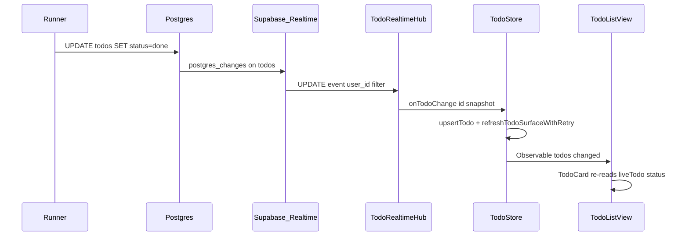
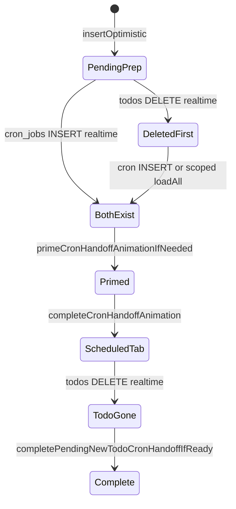

# iOS list live updates (helper)

Readable overview of how the task list stays in sync while the app is open,
and how the prep → scheduled (cron) card handoff animation is supposed to
work. For the full engineering contract (tables, migrations, rules), see
[`task-realtime.md`](task-realtime.md).

---

## How the list auto-updates when a task completes

When Hermes finishes a run, the **runner** (server-side worker) updates the
`todos` row in Postgres (`status = done`, `completed_at`, etc.). The iOS app
does **not** talk to Hermes for list state — it watches Postgres through
**Supabase Realtime**.



### Key files

| Layer | File | Role |
| ----- | ---- | ---- |
| Server writer | [`runner/runner/runner.py`](../runner/runner/runner.py) `_consume_run` | Sets `todos.status` on terminal events |
| Realtime pub | `supabase/migrations/*` | `todos` on `supabase_realtime` publication |
| Subscription | [`ios/doit/doit/Supabase/TodoRealtimeHub.swift`](../ios/doit/doit/Supabase/TodoRealtimeHub.swift) `startUserFeed` | Websocket on `todos` filtered by `user_id` |
| State | [`ios/doit/doit/Stores/TodoStore.swift`](../ios/doit/doit/Stores/TodoStore.swift) | `onTodoChange` → `upsertTodo` + `refreshTodoSurfaceWithRetry` |
| UI | [`ios/doit/doit/Views/TodoListView.swift`](../ios/doit/doit/Views/TodoListView.swift) | `todoCard` reads `store.todo(id:)`; toggle/subtitle react to `status` |

### Principles

- **`TodoStore` is the single source of truth.** Views read `store.todos` and
  must not keep their own `@State` copies of task rows. When the store
  updates, every observer re-renders automatically (`@Observable`).
- **Foreground path is Realtime, not push.** APNs is a backup when the app is
  backgrounded: `AppDelegate` posts `todoRemoteUpdate` →
  `refreshTodoSurfaceWithRetry` for the affected todo.
- **REST refresh after Realtime.** The hub may decode a quick snapshot from the
  websocket payload, but the store also fetches the full row via the typed
  REST API so dates, RLS, and column defaults stay consistent.
- **Fallbacks** when Realtime misses or the app was suspended:
  - `scenePhase == .active` → `store.loadAll()`
  - Pull-to-refresh → `loadAll()`
  - Hub `onUnknown` → full `loadAll()`

### What the user sees on completion

With the task list open and the app in the foreground:

1. **`TodoToggle`** — spinner (active) → green checkmark (`status == .done`).
2. **Subtitle** — live activity copy → `"Done"` via `TodoCard.statusText`.
3. **Section** — card moves from active list to completed list (`activeTodos`
   filters `status != .done`; `completedTodos` filters `status == .done`).
4. **Animation** — `cardRefreshID` includes `status.rawValue` so SwiftUI
   treats the transition as a real state change.

---

## Prep → cron handoff animation (how it was designed)

When the user creates a task that prep classifies as **recurring**, the runner
converts the placeholder todo into a `cron_jobs` row and deletes the todo.
The list should morph the task card into the new scheduled card and scroll to
the **Scheduled** section.

### Trigger (iOS)

User submits via `AddTodoView` → [`TodoStore.insertOptimistic`](../ios/doit/doit/Stores/TodoStore.swift)
sets `pendingNewTodoID` and `pendingNewTodoCreatedAt` so the list knows this
row is a fresh creation worth animating.

### Runner

[`_convert_prep_todo_to_cron`](../runner/runner/runner.py) in `prepare_one_todo`:

1. `insert_cron_job` (state `configuring`)
2. `delete_todo` on the placeholder

### iOS reconciliation

[`TodoListView.reconcilePendingCronHandoff`](../ios/doit/doit/Views/TodoListView.swift)
runs when `cronHandoffSignature` or `store.cronHandoffRevision` changes:

1. **`primeCronHandoffAnimationIfNeeded()`** — when `pendingNewTodoID` and
   `pendingNewTodoCronCandidateID()` both exist, set `activeCronHandoff`.
2. **`matchedGeometryEffect`** — links the todo card (Tasks tab, source) to
   the new `CronJobCard` (Scheduled tab, destination) via `taskCardNamespace`.
3. **`completeCronHandoffAnimation()`** — spring-scroll to the Scheduled
   section as soon as both the pending todo and cron candidate exist. This
   starts the animation while matched geometry can still see both endpoints.
4. **`completePendingNewTodoCronHandoffIfReady()`** — when the cron candidate
   exists **and** the todo row is gone from `store.todos`, clear pending state.
   If the todo `DELETE` arrives before the cron `INSERT`, `TodoStore` keeps
   `pendingNewTodoID` alive during a short grace window and runs one scoped
   `loadAll()` catch-up before clearing the handoff.

This replaced an older, simpler behavior (commit `8ab2f1b`): flip to Scheduled
when the pending todo row vanished, without matched geometry.



---

## Why the cron handoff animation broke before

Two independent issues explain the regression. They are documented here because
they are easy to reintroduce when changing list refresh or onboarding logic.

### Root cause A — Realtime ordering race (regression in `74c3416`)

[`removeTodoLocal`](../ios/doit/doit/Stores/TodoStore.swift) was changed so
that when the **pending** todo is deleted and **no cron candidate exists yet**,
it calls `clearPendingNewTodo()`:

```swift
if id == pendingNewTodoID {
    if pendingNewTodoCronCandidateID() != nil {
        notifyCronHandoffIfNeeded()
    } else {
        clearPendingNewTodo()  // problem when DELETE arrives before INSERT
    }
}
```

The runner writes **cron insert, then todo delete**, sequentially. Supabase
Realtime delivery order is **not guaranteed**. If the `DELETE` event arrives
before the `INSERT`:

1. `pendingNewTodoCronCandidateID()` is `nil`
2. `pendingNewTodoID` is cleared immediately
3. When the cron row arrives moments later, handoff state is gone → no section
   scroll, no geometry

Current behavior: realtime deletes from the hub call `removeTodoLocal` without
`clearPendingIfNoCandidate`. That records `pendingNewTodoDeletedAt`, bumps
`cronHandoffRevision`, and starts a short grace task. Manual user deletes still
clear the marker immediately by passing `clearPendingIfNoCandidate: true`.

**How to confirm:** Xcode console — `[cron_handoff]` and `[store][cron_handoff]`
logs. Broken case: delete handling runs before cron upsert, or `pending=` is
cleared before `candidate=` appears.

### Root cause B — Animation timing (structural)

`completeCronHandoffAnimation()` only runs inside
`completePendingNewTodoCronHandoffIfReady()`, which requires `!stillHasTodo`.
The todo card is **already removed from the list** before the section scroll
fires.

`matchedGeometryEffect` needs **both** source and destination in the view
hierarchy at the same time. Removing the todo card first drops the geometry
source, so even a healthy handoff often degrades to “jump to Scheduled tab”
without a visible morph.

Current behavior: prime and start the section scroll **while both rows exist**,
then clean up pending state after the animation window / todo delete.

### Other footguns

- Handoff only runs for todos created via `insertOptimistic` (`pendingNewTodoID`
  must be set). Tasks created elsewhere won't animate.
- `pendingNewTodoCronCandidateID()` picks the first cron job with `created_at`
  within 10 seconds of the pending todo — ambiguous if multiple crons land in
  that window.
- `upsertTodo` clears pending when `!todo.status.isActive` — would break
  handoff if prep flipped to `needs_input` before cron conversion (not the
  normal cron path).
- Do **not** add explicit `.transition(.move(...))` modifiers to active
  `TodoCard` rows to force completion animations. `TodoCard` already changes
  identity through `cardRefreshID` as status/activity changes; combining that
  with row transitions makes a preparing card appear to jump or reload from
  the bottom while its subtitle/title update.

---

## Scheduled-task chat reconfiguration

Cron chat uses the same realtime/store principle, but the runner has a separate
configuration lease:

1. iOS writes a `cron_job_messages` row or responds to a
   `cron_job_interactions` row.
2. [`CronJobsAPI.reconfigure`](../ios/doit/doit/Networking/CronJobsAPI.swift)
   sets `cron_jobs.state = configuring` **and clears `configure_claimed_at`**.
3. [`claim_next_configuring_cron_job`](../runner/runner/db.py) claims rows
   whose lease is null, stale, or older than a later reconfiguration update.
4. While the job is actually `configuring`, the cron chat appends
   `"Updating schedule…"`.

If chat gets stuck on `"Updating schedule…"`, check whether `configure_claimed_at`
was cleared or whether `updated_at` is newer than `configure_claimed_at`. A job
with `state = configuring` and a fresh, unchanged `configure_claimed_at` will
not be picked up until the stale-lease window expires.

---

## Debugging checklist

| Log | Meaning |
| --- | ------- |
| `[store] realtime todo id=… status=done` | Realtime `todos` update arrived |
| `[list][cron_handoff] prime animation todo=… cron=…` | Geometry handoff primed |
| `[list][cron_handoff] scroll to scheduled` | Section flip fired |
| `[store][cron_handoff] waiting … stillHasTodo=true` | Cron exists; waiting for todo delete |
| Handoff never starts | Check if `pendingNewTodoID` was cleared early (race A) |
| Card jumps during prep | Check for row `.transition(.move(...))` attached to `TodoCard` |
| Cron chat stuck on Updating schedule | Check `configure_claimed_at` lease reset / runner claim logs |

---

## Related docs

- [`task-realtime.md`](task-realtime.md) — full contract (hub tables, agent
  activity, migrations, hard rules)
- [`apns.md`](apns.md) — push notifications (backup path when backgrounded)
- [`runner/README.md`](../runner/README.md) — what the runner writes and when
